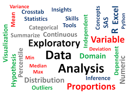

# Exploratory-Data-Analysis-Using-Python

Exploratory Data Analysis(EDA)  includes cleaning, munging, combining, reshaping, slicing, dicing, and transforming data for analysis purpose. We can understand the data by EDA and derive simple models with Pandas as baseline. EDA ia a critical and first step in analyzing the data
